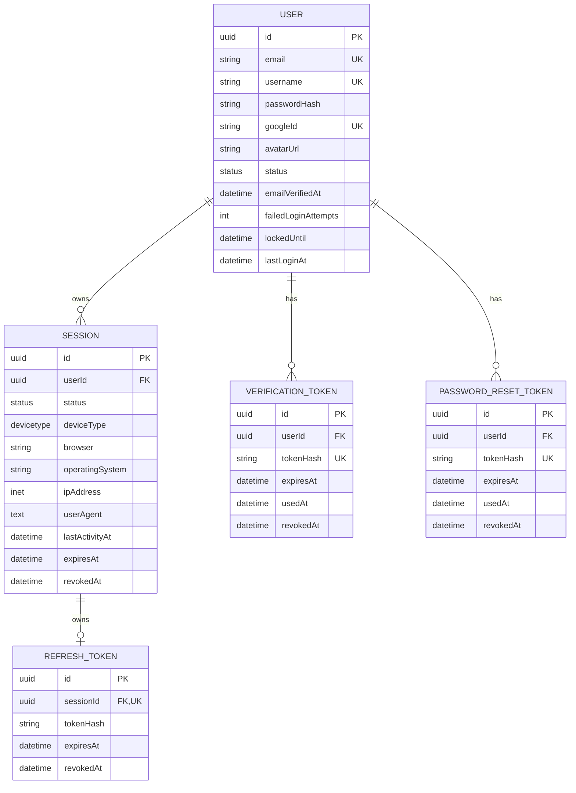
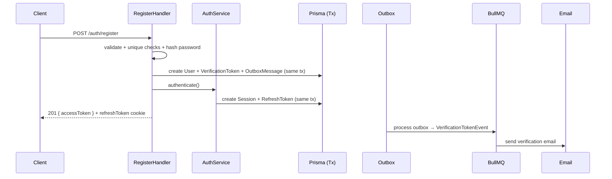
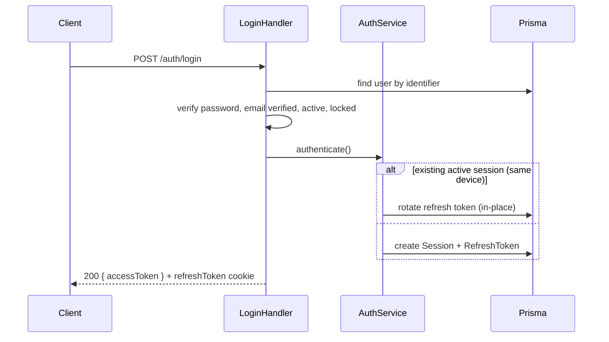
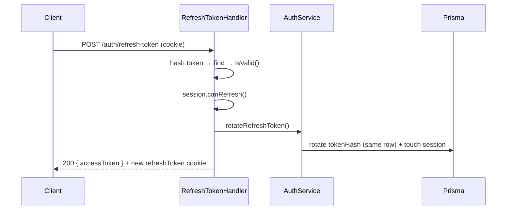

# Authentication Module

## 1. Overview

### هدف

ماژول `Authentication` مسئول تمام جنبه‌های هویت و احراز هویت کاربران در LMS است. این ماژول به‌صورت کامل پیاده‌سازی شده و شامل موارد زیر است:

- **ثبت‌نام (Registration)** با ایمیل/نام‌کاربری/رمزعبور و حساب Google
- **ورود (Login)** با ایمیل یا نام‌کاربری و رمزعبور، و ورود با Google
- **مدیریت Session** (ایجاد، مشاهده، ابطال، خروج از یک دستگاه یا همه دستگاه‌ها)
- **تأیید ایمیل (Email Verification)** و ارسال مجدد توکن تأیید
- **مدیریت رمزعبور (Password Management)**: فراموشی رمزعبور، بازنشانی رمزعبور، تغییر رمزعبور
- **Refresh Access Token** و چرخش توکن

### مرزها (Boundaries)

ماژول Authentication **مالک** موارد زیر است:

- مدل دامنه‌ی هویت (User, Session, VerificationToken, PasswordResetToken, RefreshToken)
- قوانین کسب‌وکار احراز هویت (سیاست رمزعبور، قفل حساب، انقضاها، چرخش توکن)
- persistence مربوط به موجودیت‌های خود (از طریق Prisma)
- ارسال ایمیل‌های مرتبط با احراز هویت (تأیید ایمیل و بازنشانی رمزعبور)

ماژول Authentication **مالک** موارد زیر **نیست**:

- زیرساخت‌های عمومی پروژه (Prisma, Redis, BullMQ, SMTP, Outbox) — این‌ها در ماژول‌های `shared` زندگی می‌کنند
- سایر دامنه‌های LMS (دوره‌ها، دانشجویان، و...)
- Rate Limiting و Audit Log — **پیاده‌سازی نشده‌اند** (به بخش 18 مراجعه کنید)

### روابط با سایر ماژول‌ها

- به `PrismaModule` (پایگاه داده)، `RedisModule` (کش)، `QueueModule` + `EmailModule` (BullMQ و SMTP)، و `CommonModule` (Outbox) وابسته است.
- جهت وابستگی همیشه از feature به سمت shared است؛ هیچ ماژول shared به این ماژول وابسته نیست.

---

## 2. Architecture

معماری واقعی پیاده‌سازی‌شده به شرح زیر است:

### Modular Monolith

پروژه یک **Modular Monolith** است: یک ماژول feature (`identity/authentication`) به‌همراه چند ماژول shared. همه‌چیز در یک فرایند اجرا می‌شود، اما مرزهای ماژولی از طریق NestJS Module ها حفظ شده‌اند.

### DDD (Domain-Driven Design)

لایه‌بندی چهارگانه به‌صورت واقعی پیاده‌سازی شده است:

```
presentation (Controllers/DTOs/Guards/Swagger)
    ↓
application (Commands/Queries/Handlers/Services/Ports/Factories/Producers/Workers)
    ↓
domain (Entities/Value Objects/Repository Interfaces/Exceptions/Enums)
    ↑
infrastructure (Prisma Repositories/Cached Repositories/Mappers/Security)
```

- **Domain** مالک قوانین کسب‌وکار است (موجودیت‌های غنی با رفتار، Value Object های خود-اعتبارسنج).
- **Application** use case ها را orchestrate می‌کند (Command/Query Handler ها).
- **Infrastructure** persistence و سرویس‌های خارجی را پیاده‌سازی می‌کند.
- Domain به Prisma یا هر جزئیات زیرساختی وابسته **نیست**.

### CQRS

تمام use case ها از طریق `@nestjs/cqrs` به‌صورت Command/Query Handler پیاده‌سازی شده‌اند:

- ۱۲ Command handler
- ۲ Query handler
- یک سرویس application مشترک (`AuthenticationService`) که توسط handler ها برای عملیات session/token استفاده می‌شود.

### جهت وابستگی

- Domain ← Application ← Presentation
- Infrastructure ← Domain (Interfaces را پیاده‌سازی می‌کند)
- Feature ← Shared (هرگز برعکس)
- تفکیک Command (نوشتن) و Query (خواندن) در application layer

---

## 3. Module Structure

```
src/modules/identity/authentication/
├── authentication.module.ts          # ماژول NestJS — DI wiring
├── domain/
│   ├── entities/                     # User, Session, VerificationToken, PasswordResetToken, RefreshToken
│   ├── value-objects/                # Email, Username, Password, PasswordHash
│   ├── repositories/                 # رابط‌های Repository (اینترفیس)
│   ├── enums/                        # AuthErrorCode, UserStatus, SessionStatus/DeviceType
│   └── exceptions/                   # ۲۴ exception دامنه
├── application/
│   ├── commands/                     # Commands + Handlers (auth, password, session, verify-email)
│   ├── queries/                      # Queries + Handlers (me, sessions)
│   ├── services/                     # AuthenticationService, VerificationTokenService
│   ├── factories/                    # TokenGeneratorFactory
│   ├── ports/                        # اینترفیس‌های Application (Ports) — شامل EmailProducer (abstract port)
│   ├── contracts/                    # قراردادهای داده‌ای (AuthenticationResult, CurrentUser, ...)
│   ├── events/                       # VerificationTokenEvent, PasswordResetTokenEvent, outbox factories
│   ├── event-handlers/               # هندلرهای رویداد (ارسال ایمیل)
│   ├── config/                       # AUTH_CONFIG (ثابت‌های سیاست)
│   └── tokens/                       # DI tokens (Symbol ها) — شامل EMAIL_PRODUCER
├── infrastructure/
│   ├── persistence/                  # Prisma repositories + Cached repositories + DTOهای سریال‌سازی
│   ├── mappers/                      # نگاشت Domain ↔ Prisma
│   ├── security/                     # JWT, bcrypt, token generator/hasher, clock, Google strategy
│   └── email/                        # زیرساخت ایمیل اختصاصی Authentication:
│       ├── email.producer.ts         # BullMQEmailProducer (پیاده‌سازی EmailProducer port)
│       ├── email.module.ts           # AuthenticationEmailModule (DI wiring)
│       ├── jobs/                     # send-email.jobs.ts (ثابت‌ها و اینترفیس‌های job)
│       ├── workers/                  # VerificationEmailWorker, PasswordResetEmailWorker
│       └── templates/                # VerifyEmailTemplate, PasswordResetEmailTemplate
└── presentation/
    ├── controllers/                  # AuthenticationController, VerificationController, PasswordController, SessionController
    ├── dto/                          # RegisterDto, LoginDto, VerifyEmailDto, ForgotPasswordDto, PasswordResetDto, ChangePasswordDto
    ├── guards/                       # JwtAuthGuard
    ├── decorators/                   # Public, CurrentUser, RefreshTokenCookie, GoogleUser
    ├── mappers/                      # AuthenticationContextMapper
    └── swagger/                      # مستندات Swagger هر endpoint
```

### مسئولیت فایل‌های مهم

- `authentication.module.ts`: ماژول NestJS. همه‌ی handler ها، سرویس‌ها، repository ها و provider ها را با DI ثبت می‌کند. `JwtAuthGuard` را به‌عنوان `APP_GUARD` سراسری ثبت می‌کند (با `@Public()` برای endpoint های عمومی).
- `domain/entities/*`: مدل دامنه‌ی غنی با قوانین کسب‌وکار.
- `application/services/authentication.service.ts`: orchestration عملیات session/refresh-token/revoke.
- `application/factories/token-generator.factory.ts`: تولید و هش توکن‌های verification/reset.
- `infrastructure/security/jwt-strategy.ts`: اعتبارسنجی Access Token در هر درخواست.
- `infrastructure/persistence/cached-*.repository.ts`: کش Redis با fallback به دیتابیس.

---

## 4. Use Cases

### UC-01 — Register (ثبت‌نام با ایمیل)

- **هدف:** ایجاد حساب کاربری جدید با ایمیل، نام‌کاربری و رمزعبور.
- **نقطه ورود:** `POST /api/auth/register` (Public)
- **Command:** `RegisterCommand` | **Handler:** `RegisterHandler`
- **عملیات:** اعتبارسنجی DTO → ساخت VOs (Email/Username/Password) → بررسی یکتایی ایمیل و نام‌کاربری → هش رمزعبور (bcrypt) → ساخت `User` → ذخیره → ساخت VerificationToken + ثبت پیام Outbox → ساخت Session/RefreshToken/AccessToken.
- **نتیجه:** `{ accessToken }` + کوکی `refreshToken` (HttpOnly). کد 201.
- **خطاها:** `EmailAlreadyExistsException`, `UsernameAlreadyExistsException` (422)، خطای race با catch کردن `P2002`، خطای اعتبارسنجی (400).

### UC-02 — Login با ایمیل/نام‌کاربری و رمزعبور

- **نقطه ورود:** `POST /api/auth/login` (Public)
- **Command:** `LoginCommand` | **Handler:** `LoginHandler`
- **عملیات:** یافتن کاربر با شناسه (نرمال‌سازی: اگر `@` دارد، lowercase/trim) → بررسی وجود رمزعبور → مقایسه رمزعبور → بررسی تأیید ایمیل → بررسی فعال بودن → بررسی قفل → ثبت ورود موفق → ساخت/چرخش Session.
- **نتیجه:** `{ accessToken }` + کوکی refreshToken. کد 200.
- **خطاها:** خطای یکسان 401 `InvalidCredentialsException` برای (کاربر ناموجود / رمز عبور غلط / غیرفعال / قفل) جهت جلوگیری از User Enumeration؛ 422 برای ایمیل تأییدنشده؛ 401 برای حساب Google-only.

### UC-03 — Login با Google

- **نقطه ورود:** `GET /api/auth/google` و `GET /api/auth/google/callback` (Public)
- **Command:** `GoogleLoginCommand` | **Handler:** `GoogleLoginHandler`
- **عملیات:** استراتژی Passport Google → بررسی `emailVerified` از گوگل → جستجوی کاربر با googleId → در صورت وجود، login؛ در صورت نبود، بررسی نبود حساب با همان ایمیل (در صورت وجود → `AccountExistsWithoutGoogleException`) → ساخت کاربر جدید با نام‌کاربری یکتا.
- **نتیجه:** ریدایرکت به فرانت‌اند با `#accessToken=...` (fragment) + کوکی refreshToken.

### UC-04 — Verify Email

- **نقطه ورود:** `POST /api/auth/verify-email` (Public)
- **Command:** `VerifyEmailCommand` | **Handler:** `VerifyEmailHandler` (تراکنشی)
- **عملیات:** هش کردن توکن دریافتی → جستجو → `use()` → یافتن کاربر → `verifyEmail()` → ذخیره.
- **خطاها:** `NotUsableVerificationTokenException` (422).

### UC-05 — Resend Verification Email

- **نقطه ورود:** `POST /api/auth/resend-verification-token` (Bearer)
- **Command:** `ResendVerificationTokenCommand` | **Handler:** `ResendVerificationTokenHandler` (تراکنشی)
- **عملیات:** یافتن کاربر از توکن → بررسی تأییدنبودن ایمیل → بررسی cooldown (۲ دقیقه) → revoke توکن قبلی → ساخت توکن جدید + Outbox.
- **خطاها:** `UserNotFoundException` (404), `EmailAlreadyVerifiedException` (422), `VerificationTokenResendTooSoonException` (422).

### UC-06 — Forgot Password

- **نقطه ورود:** `POST /api/auth/forgot-password` (Public)
- **Command:** `ForgotPasswordCommand` | **Handler:** `ForgotPasswordHandler` (تراکنشی)
- **عملیات:** یافتن کاربر با ایمیل → **همیشه 200 برمی‌گرداند** (ضد User Enumeration؛ در صورت نبود کاربر فقط لاگ می‌شود) → بررسی cooldown → revoke توکن قبلی → ساخت PasswordResetToken + ثبت Outbox.
- **نکته:** ارسال ایمیل از طریق Outbox انجام می‌شود (همان الگوی Verification).

### UC-07 — Reset Password

- **نقطه ورود:** `POST /api/auth/reset-password` (Public)
- **Command:** `ResetPasswordCommand` | **Handler:** `ResetPasswordHandler` (تراکنشی)
- **عملیات:** هش توکن → یافتن توکن → اعتبارسنجی (not usable → خطا) → ساخت Password جدید → بررسی نبودِ همان رمز قبلی → تغییر رمزعبور → `use()` و `revoke()` توکن → **خروج از همه‌ی session ها**.
- **خطاها:** `NotUsablePasswordResetTokenException`, `PasswordSameAsOldException` (422).

### UC-08 — Refresh Access Token

- **نقطه ورود:** `POST /api/auth/refresh-token` (Public — کوکی)
- **Command:** `RefreshTokenCommand` | **Handler:** `RefreshTokenHandler`
- **عملیات:** هش کردن refresh token → جستجو → `isValid()` → بررسی `session.canRefresh()` → یافتن کاربر → `rotateRefreshToken`.
- **نتیجه:** `{ accessToken }` + کوکی refreshToken جدید (چرخش درجا — همان ردیف).
- **خطاها:** `InvalidRefreshTokenException`, `SessionIsInvalidOrRevokedException`, `RefreshTokenNotFoundException` (422).

### UC-09 — Logout Current Device

- **نقطه ورود:** `DELETE /api/auth/logout` (Bearer)
- **Command:** `LogoutCurrentDeviceCommand` | **Handler:** `LogoutCurrentDeviceHandler`
- **عملیات:** `revokeSession(userId, sessionId)` → حذف کوکی.
- **نتیجه:** 200.

### UC-10 — Logout All Devices

- **نقطه ورود:** `DELETE /api/auth/sessions` (Bearer)
- **Command:** `LogoutAllDevicesCommand` | **Handler:** `LogoutAllSessionsHandler`
- **عملیات:** `revokeAllSessions(userId)` → حذف کوکی.
- **نتیجه:** 200.

### UC-11 — Get Active Sessions

- **نقطه ورود:** `GET /api/auth/sessions` (Bearer)
- **Query:** `GetActiveSessionsQuery` | **Handler:** `GetActiveSessionsHandler`
- **عملیات:** `findAllActiveByUserId` → نگاشت به `ActiveSession[]`.
- **نتیجه:** 200 با لیست session های فعال.

### UC-12 — Revoke Specific Session

- **نقطه ورود:** `DELETE /api/auth/sessions/:sessionId` (Bearer)
- **Command:** `LogoutSpecificDeviceCommand` | **Handler:** `LogoutSpecificDeviceHandler`
- **عملیات:** بررسی مالکیت session → `revokeSessionAndToken`.
- **خطاها:** `SessionIsInvalidOrRevokedException` (422).

### UC-13 — Change Password

- **نقطه ورود:** `PATCH /api/auth/change-password` (Bearer)
- **Command:** `ChangePasswordCommand` | **Handler:** `ChangePasswordHandler` (تراکنشی)
- **عملیات:** بررسی رمزعبور فعلی → بررسی نبودِ همان رمز قبلی → تغییر رمزعبور → **خروج از همه‌ی session ها به‌جز session فعلی**.
- **خطاها:** `PasswordIsIncorrectException`, `PasswordSameAsOldException`, `PasswordLoginNotAvailableException` (422).

### UC-14 — Get Current User

- **نقطه ورود:** `GET /api/auth/me` (Bearer)
- **Query:** `GetCurrentUserQuery` | **Handler:** `GetCurrentUserHandler`
- **نتیجه:** 200 با اطلاعات کاربر.

---

## 5. Domain Model

### Entities

#### User (`domain/entities/user.entity.ts`)

- **مسئولیت:** نمایانگر شخصی که حساب دارد و می‌تواند احراز هویت کند. **Aggregate Root.**
- **صفات:** `id`, `email`, `username`, `passwordHash`, `googleId`, `avatarUrl`, `emailVerifiedAt`, `status`, `failedLoginAttempts`, `lockedUntil`, `lastLoginAt`, `createdAt`, `updatedAt`
- **رفتارها:** `register()`, `registerWithGoogle()`, `verifyEmail()`, `changePassword()`, `recordSuccessfulLogin()`, `recordFailedLogin()`, `lock()`, `unlock()`, `suspend()`, `activate()`, `ban()`, `markAsDeleted()`, `isLocked()`, `isEmailVerified()`, `isActive()`, `hasPassword()`, `touch()` (خصوصی)
- **Invariants:**
  - پس از ۵ تلاش ناموفق (`MAX_FAILED_LOGIN_ATTEMPTS = 5`)، حساب برای ۳۰ دقیقه (`LOCK_DURATION_MINUTES = 30`) قفل می‌شود.
  - `recordSuccessfulLogin` شمارنده‌ی تلاش‌ها و قفل را بازنشانی می‌کند.
  - `isActive()` فقط `status === ACTIVE`.
  - ورود فقط با ایمیل تأییدشده مجاز است (بررسی در `LoginHandler`).
- **روابط:** یک User می‌تواند Session های متعدد، VerificationToken و PasswordResetToken داشته باشد.

#### Session (`domain/entities/session.entity.ts`)

- **مسئولیت:** نمایانگر یک نشست ورودِ احراز هویت‌شده؛ مالک RefreshToken. **Aggregate Root.**
- **صفات:** `id`, `userId`, `status`, `deviceType`, `browser`, `operatingSystem`, `ipAddress`, `userAgent`, `lastActivityAt`, `expiresAt`, `revokedAt`, `createdAt`, `updatedAt`
- **رفتارها:** `create()`, `revoke()`, `expire()`, `refreshActivity()`, `isActive()`, `isExpired()`, `isRevoked()`, `canRefresh()`, `touch()` (خصوصی)
- **Invariants:**
  - `isActive()` = status ACTIVE + نه منقضی + نه revoke شده.
  - `canRefresh()` = `isActive()`.
  - عمر session: **۱۵ روز** (انقضای مطلق؛ با هر refresh فقط `lastActivityAt` به‌روزرسانی می‌شود).
  - تمام mutator ها `updatedAt` را با `touch()` به‌روزرسانی می‌کنند.
- **روابط:** به یک User تعلق دارد؛ یک RefreshToken دارد.

#### VerificationToken (`domain/entities/verification-token.entity.ts`)

- **مسئولیت:** توکن یک‌بارمصرف برای تأیید ایمیل.
- **صفات:** `id`, `userId`, `tokenHash`, `expiresAt`, `usedAt`, `revokedAt`, `createdAt`
- **رفتارها:** `create()`, `use()`, `revoke()`, `isExpired()`, `isUsed()`, `isRevoked()`, `isUsable()`
- **Invariants:** `isUsable()` = نه منقضی + نه استفاده‌شده + نه revoke شده؛ `use()` فقط روی توکن usable.
- **روابط:** به یک User تعلق دارد.

#### PasswordResetToken (`domain/entities/password-reset-token.entity.ts`)

- **مسئولیت:** توکن یک‌بارمصرف برای بازنشانی رمزعبور.
- **صفات و رفتارها:** مشابه VerificationToken.
- **روابط:** به یک User تعلق دارد.

#### RefreshToken (`domain/entities/refresh-token.entity.ts`)

- **مسئولیت:** اعتبار طولانی‌مدت برای گرفتن Access Token جدید.
- **صفات:** `id`, `sessionId`, `tokenHash`, `expiresAt`, `revokedAt`, `createdAt`
- **رفتارها:** `create()`, `revoke()`, `rotate(hash)`, `isExpired()`, `isRevoked()`, `isValid()`
- **Invariants:** `isValid()` = نه منقضی + نه revoke شده؛ `rotate()` هش را درجا (همان ردیف) جایگزین می‌کند.
- **روابط:** به یک Session تعلق دارد (یک‌به‌یک).

### Value Objects

#### Email (`domain/value-objects/email.vo.ts`)

- **هدف:** نمایش ایمیل با نرمال‌سازی (trim + lowercase) و اعتبارسنجی.
- **اعتبارسنجی:** regex ساده‌ی `^[^\s@]+@[^\s@]+\.[^\s@]+$`.
- **رفتار:** `create()`, `getValue()`, `equals()`.

#### Username (`domain/value-objects/username.vo.ts`)

- **هدف:** نمایش نام‌کاربری با اعتبارسنجی.
- **اعتبارسنجی:** ۳ تا ۳۰ کاراکتر، شروع با حرف، فقط حروف/اعداد/underscore، بدون `__` پشت‌سرهم و بدون پایان با `_`.
- **رفتار:** `create()`, `getValue()`, `equals()`, `toString()`, `isValid()`.

#### Password (`domain/value-objects/password.vo.ts`)

- **هدف:** نمایش رمزعبور خام (قبل از هش) با سیاست امنیتی.
- **اعتبارسنجی:** ۸ تا ۶۴ کاراکتر، شامل حرف بزرگ، حرف کوچک، رقم و کاراکتر خاص.
- **رفتار:** `create()` (throw `PasswordIsWeakException` در صورت ضعف), `getValue()`.

#### PasswordHash (`domain/value-objects/password-hash.vo.ts`)

- **هدف:** نمایش رمزعبور هش‌شده.
- **اعتبارسنجی:** مقدار غیرخالی.
- **رفتار:** `create()`, `getValue()`.

### Domain Services

هیچ Domain Service مستقلی در کد وجود ندارد. (منطق مشترک بین موجودیت‌ها در `AuthenticationService` در لایه‌ی application قرار دارد.)

---

## 6. Business Rules

قوانین پیاده‌سازی‌شده، سازمان‌یافته:

### ثبت‌نام

- هر ایمیل فقط به یک حساب تعلق دارد (unique در DB + بررسی).
- هر نام‌کاربری یکتا است (unique در DB + بررسی).
- رمزعبور باید سیاست `Password` VO را رعایت کند.
- رمزعبور هرگز به‌صورت plain ذخیره نمی‌شود (bcrypt).
- حساب تازه‌ساخته `emailVerifiedAt = null` دارد (تأییدنشده) اما `status = ACTIVE` است.
- برای هر ثبت‌نام یک VerificationToken با انقضا (۱۵ دقیقه) ساخته می‌شود و پیام Outbox ثبت می‌شود.
- در صورت race همزمان (P2002)، خطای مناسب ۴۲۲ برگردانده می‌شود.

### ورود

- فقط حساب‌های موجود می‌توانند وارد شوند.
- فقط حساب‌های فعال (`isActive`) مجازند؛ حساب BANNED/SUSPENDED/DELETED مجاز نیست.
- رمزعبور باید با hash ذخیره‌شده مطابقت کند.
- **ایمیل باید تأیید شده باشد** (P3-1).
- تلاش ناموفق → `recordFailedLogin`؛ پس از ۵ تلاش → قفل ۳۰ دقیقه‌ای.
- ورود موفق → بازنشانی شمارنده و ساخت/چرخش Session.
- تمام خطاهای ورود (ناموجود/رمز غلط/قفل/غیرفعال) به یک پاسخ 401 یکسان نگاشت می‌شوند (ضد User Enumeration — P5-2).

### تأیید ایمیل

- توکن فقط یک‌بار قابل استفاده است؛ منقضی یا revoke شده پذیرفته نمی‌شود.
- ایمیل تأییدشده دوباره تأیید نمی‌شود؛ ارسال مجدد برای ایمیل تأییدشده خطا می‌دهد.
- هنگام صدور توکن جدید، توکن قبلی revoke می‌شود (یک توکن فعال در هر لحظه).
- cooldown ارسال مجدد: ۲ دقیقه.

### رمزعبور

- رمزعبور جدید نمی‌تواند همان رمز قبلی باشد.
- بازنشانی رمزعبور → خروج از همه‌ی session ها.
- تغییر رمزعبور → خروج از همه‌ی session ها **به‌جز** session فعلی.
- Forgot-Password **همیشه 200** برمی‌گرداند (وجود ایمیل فاش نمی‌شود).

### Session و Refresh Token

- عمر session و refresh token: ۱۵ روز.
- عمر access token (JWT): ۱۵ دقیقه.
- refresh token با `sessionId @unique` یک‌به‌یک است؛ چرخش درجا (همان ردیف).
- revoke شدن session → revoke شدن refresh token آن.
- `JwtStrategy.validate` از `session.isActive()` استفاده می‌کند (پوشش انقضا + ابطال).

### قوانینی که از سند طراحی اصلی **پیاده‌سازی نشده‌اند** (مهم):

- **Audit Log** (ثبت رویدادهای ورود/خروج/تغییر رمزعبور در لاگ ممیزی) — وجود ندارد.
- **Rate Limiting** — وجود ندارد.
- **Refresh Token Reuse Detection** — وجود ندارد (چرخش درجا، بدون ردیابی reuse).
- **BR-03 «کاربرِ واردشده نمی‌تواند ثبت‌نام کند»** — بررسی نمی‌شود (endpoint عمومی است).

---

## 7. Domain Events

در پیاده‌سازی فعلی **دو رویداد** وجود دارد که هر دو از طریق **Outbox Pattern** منتشر می‌شوند:

### VerificationTokenEvent (`application/events/verification-token.event.ts`)

- **هدف:** درخواست ارسال ایمیل تأیید.
- **زمان وقوع:** پس از ثبت‌نام و پس از ارسال مجدد توکن.
- **ناشر:** `VerificationTokenService` (ذخیره‌ی OutboxMessage در همان تراکنش).
- **مصرف‌کننده:** `VerificationTokenEventHandler` ← `EmailProducer` (abstract port) ← `BullMQEmailProducer` (infrastructure) ← `VerificationEmailWorker` (infrastructure اختصاصی Authentication) ← `EmailSender` (shared) ← SMTP.

### PasswordResetTokenEvent (`application/events/password-reset-token.event.ts`)

- **هدف:** درخواست ارسال ایمیل بازنشانی رمزعبور.
- **زمان وقوع:** پس از درخواست Forgot-Password.
- **ناشر:** `ForgotPasswordHandler` (ذخیره‌ی OutboxMessage در همان تراکنش).
- **مصرف‌کننده:** `PasswordResetTokenEventHandler` ← `EmailProducer` (abstract port) ← `BullMQEmailProducer` (infrastructure) ← `PasswordResetEmailWorker` (infrastructure اختصاصی Authentication) ← `EmailSender` (shared) ← SMTP.

### رفتار Outbox

- `OutboxProcessorService` هر ۵ ثانیه پیام‌های پردازشنشده را می‌خواند (تا ۲۰ پیام).
- نگاشت `eventType → factory` از ماژول feature از طریق `OUTBOX_EVENT_FACTORIES` تزریق می‌شود.
- نوع ناشناخته → discard با لاگ warn.
- خطا → `incrementAttempts`؛ پس از ۵ تلاش → discard.

---

## 8. Application Layer

### Commands و Handlers

| Command | Handler | تراکنشی |
|---|---|---|
| `RegisterCommand` | `RegisterHandler` | ✅ (registerUser) |
| `LoginCommand` | `LoginHandler` | — |
| `GoogleLoginCommand` | `GoogleLoginHandler` | — |
| `RefreshTokenCommand` | `RefreshTokenHandler` | — |
| `VerifyEmailCommand` | `VerifyEmailHandler` | ✅ |
| `ResendVerificationTokenCommand` | `ResendVerificationTokenHandler` | ✅ |
| `ForgotPasswordCommand` | `ForgotPasswordHandler` | ✅ |
| `ResetPasswordCommand` | `ResetPasswordHandler` | ✅ |
| `ChangePasswordCommand` | `ChangePasswordHandler` | ✅ |
| `LogoutCurrentDeviceCommand` | `LogoutCurrentDeviceHandler` | — |
| `LogoutAllDevicesCommand` | `LogoutAllSessionsHandler` | — |
| `LogoutSpecificDeviceCommand` | `LogoutSpecificDeviceHandler` | — |

### Queries و Handlers

| Query | Handler |
|---|---|
| `GetCurrentUserQuery` | `GetCurrentUserHandler` |
| `GetActiveSessionsQuery` | `GetActiveSessionsHandler` |

### Application Services

- **`AuthenticationService`**: orchestration — `authenticate()` (استفاده‌ی مجدد یا ساخت session)، `createNewSession()`، `rotateRefreshToken()`، `revokeAllSessions()`، `revokeSession()`، `revokeSessionAndToken()`. همگی `@Injectable` و تراکنشی (به‌جز `createNewSession` و `revokeSessionAndToken` که توسط caller های تراکنشی صدا زده می‌شوند).
- **`VerificationTokenService`**: ساخت VerificationToken + ثبت OutboxMessage.

### Factories

- **`TokenGeneratorFactory`**: تولید توکن تصادفی امن → هش SHA-256 → `expiresAt` (۱۵ دقیقه). برای verification و reset استفاده می‌شود.

### Ports (اینترفیس‌های Application)

- `AccessTokenGenerator` (generate/verify JWT)
- `PasswordHasher` (hash/hashToValueObject/compare)
- `TokenGenerator` (تولید توکن تصادفی)
- `TokenHasher` (هش SHA-256)
- `Clock` (تاریخ فعلی)
- `AuthenticatedUser` (قرارداد داده‌ای کاربر احراز هویت‌شده)
- `EmailProducer` (abstract port برای ارسال ایمیل — `sendVerificationEmail` و `sendPasswordResetEmail`)

### Contracts

- `AuthenticationResult { accessToken, refreshToken }`
- `AuthenticationContext { deviceType, browser, operatingSystem, ipAddress, userAgent }`
- `CurrentUserType`
- `ActiveSession`
- `GoogleUserProfile`

---

## 9. Infrastructure Layer

### Prisma / PostgreSQL

- از طریق `PrismaService` (که `PrismaClient` را با `PrismaPg` adapter گسترش می‌دهد) و `@nestjs-cls/transactional` استفاده می‌شود.
- Repository های پرایزما تراکنش را از `TransactionHost` (CLS) می‌گیرند.

### Redis

- **دو نقش:** (۱) کش برای `CachedUserRepository` و `CachedSessionRepository` (TTL ۱۵ دقیقه، با اعتبارسنجی هنگام deserialize و fallback امن به DB در صورت قطعی)، (۲) پشتیبان BullMQ.
- کلاینت از طریق `REDIS_CLIENT` تزریق می‌شود.

### BullMQ

- صف `EMAIL_QUEUE` با retry (۳ تلاش، backoff exponential). برای ارسال ایمیل‌های تأیید و بازنشانی.
- زیرساخت BullMQ در `shared/queue/queue.module.ts` پیکربندی می‌شود (اتصال به Redis).

### Email Infrastructure

- **زیرساخت اختصاصی Authentication** (`infrastructure/email/`):
  - `BullMQEmailProducer` — پیاده‌سازی abstract port `EmailProducer` با استفاده از BullMQ queue.
  - `VerificationEmailWorker` — پردازش job ایمیل تأیید؛ از `VerifyEmailTemplate` و `EmailSender` استفاده می‌کند.
  - `PasswordResetEmailWorker` — پردازش job ایمیل بازنشانی رمزعبور؛ از `PasswordResetEmailTemplate` و `EmailSender` استفاده می‌کند.
  - `AuthenticationEmailModule` — ثبت DI برای producer و worker ها.
- **زیرساخت عمومی** (`shared/email/`):
  - `SmtpEmailSender` (nodemailer) پشت `EMAIL_SENDER`؛ تنظیمات از `ConfigService` (SMTP_HOST/PORT/FROM).
  - ماژول `EmailModule` فقط `SmtpEmailSender` را ثبت و export می‌کند (بدون worker یا producer).

### Ports (اینترفیس‌های Application)

- `EmailProducer` — abstract port برای ارسال ایمیل‌ها; توسط `BullMQEmailProducer` در infrastructure پیاده‌سازی می‌شود.
- رویداد handler ها (`VerificationTokenEventHandler`, `PasswordResetTokenEventHandler`) فقط به این abstract port وابسته‌اند، نه به پیاده‌سازی BullMQ.

### JWT

- `JwtTokenGenerator` (از `@nestjs/jwt`): payload `{ sub, sessionId }`، انقضای ۱۵ دقیقه، secret از `ConfigService` (`JWT_ACCESS_SECRET`).
- `JwtStrategy` (passport-jwt): اعتبارسنجی در هر درخواست با `session.isActive()` و بررسی مالکیت.

### هش رمزعبور

- `BcryptPasswordHasher` با ۱۲ round.

### تولید و هش توکن

- `CryptoTokenGenerator`: `randomBytes(32).toString('hex')` — تولید امن.
- `Sha256TokenHasher`: هش SHA-256 قبل از ذخیره‌ی توکن‌ها.

### Outbox

- `OutboxMessage` entity، `OutboxMessageRepository`، `PrismaOutboxRepository`، `OutboxProcessorService` (Cron هر ۵ ثانیه).

### Google OAuth

- `GoogleStrategy` (passport-google-oauth20) با `GOOGLE_CLIENT_ID/SECRET/CALLBACK_URL`.

---

## 10. Persistence Model

مدل‌های Prisma در `prisma/identity/authentication/` و `prisma/outbox-message.prisma` تعریف شده‌اند (schema چندفایله با `prisma.config.ts`).

### User → جدول `users`

| ستون | نوع | محدودیت |
|---|---|---|
| id | UUID | PK |
| email | VarChar(255) | UNIQUE، index |
| username | VarChar(50) | UNIQUE، index |
| passwordHash | VarChar(255) | Nullable (حساب Google دارد؟) |
| googleId | VarChar(255) | UNIQUE، Nullable |
| avatarUrl | VarChar(500) | Nullable |
| status | UserStatus | default ACTIVE، index |
| emailVerifiedAt | Timestamptz | Nullable |
| failedLoginAttempts | Int | default 0 |
| lockedUntil | Timestamptz | Nullable |
| lastLoginAt | Timestamptz | Nullable |
| createdAt / updatedAt | Timestamptz | — |

### Session → جدول `sessions`

| ستون | نوع | محدودیت |
|---|---|---|
| id | UUID | PK |
| userId | UUID | FK → users.id، index، onDelete Cascade |
| status | SessionStatus | default ACTIVE، index |
| deviceType | DeviceType | default UNKNOWN |
| browser | VarChar(100) | — |
| operatingSystem | VarChar(100) | — |
| ipAddress | Inet | — |
| userAgent | Text | — |
| lastActivityAt / expiresAt | Timestamptz | — |
| revokedAt | Timestamptz | Nullable |
| createdAt / updatedAt | Timestamptz | — |

### RefreshToken → جدول `refresh_tokens`

| ستون | نوع | محدودیت |
|---|---|---|
| id | UUID | PK |
| sessionId | UUID | **UNIQUE**، FK → sessions.id، onDelete Cascade |
| tokenHash | VarChar(255) | — |
| expiresAt | Timestamptz | index |
| revokedAt | Timestamptz | Nullable |
| createdAt | Timestamptz | — |

### VerificationToken → جدول `verification_tokens`

| ستون | نوع | محدودیت |
|---|---|---|
| id | UUID | PK |
| userId | UUID | FK → users.id، index، onDelete Cascade |
| tokenHash | VarChar(255) | **UNIQUE** |
| expiresAt | Timestamptz | — |
| usedAt / revokedAt | Timestamptz | Nullable |
| createdAt | Timestamptz | — |

### PasswordResetToken → جدول `password_reset_tokens`

ساختار مشابه VerificationToken (با `tokenHash UNIQUE` و index روی userId).

### OutboxMessage → جدول `outbox_messages`

| ستون | نوع | محدودیت |
|---|---|---|
| id | String | PK (uuid) |
| eventType | String | — |
| payload | Json | — |
| createdAt | DateTime | — |
| processedAt | DateTime | Nullable، index |
| attempts | Int | default 0 |
| lastError | String | Nullable |

### Enums

- `UserStatus`: ACTIVE, BANNED, SUSPENDED, DELETED
- `SessionStatus`: ACTIVE, REVOKED, EXPIRED
- `DeviceType`: DESKTOP, MOBILE, TABLET, UNKNOWN

### ERD



---

## 11. Authentication Flows

### ثبت‌نام (Register)



### ورود (Login)



### چرخش توکن (Refresh)



سایر جریان‌ها (verify-email، resend، forgot/reset/change-password، logout) در بخش 4 توضیح داده شدند.

---

## 12. Session & Token Management

### Access Token (JWT)

- تولید با `JwtTokenGenerator`؛ payload: `{ sub: userId, sessionId }`؛ انقضا: ۱۵ دقیقه؛ در Authorization header (`Bearer`) ارسال می‌شود.
- اعتبارسنجی در هر درخواست توسط `JwtStrategy`: یافتن session از cache/DB، بررسی `isActive()` (شامل انقضا و ابطال) و مالکیت.

### Refresh Token

- **تولید:** `randomBytes(32)` hex (امن رمزنگاری).
- **هش:** SHA-256 قبل از ذخیره در DB (فقط hash ذخیره می‌شود).
- **ذخیره:** در جدول `refresh_tokens` با `sessionId @unique`.
- **انقضا:** ۱۵ روز (همان session).
- **چرخش:** **درجا (in-place)** — در `rotateRefreshToken` همان ردیف با hash جدید به‌روزرسانی می‌شود (سازگار با `sessionId @unique`).
- **ابطال:** همراه session (در logout، تغییر/بازنشانی رمزعبور).
- **تشخیص Reuse:** **پیاده‌سازی نشده** — استفاده‌ی مجدد از توکن قدیمی صرفاً به `findByTokenHash → null → InvalidRefreshTokenException` ختم می‌شود (خانواده‌ی session ابطال نمی‌شود).

### کوکی HttpOnly

- نام کوکی: `refreshToken`؛ `httpOnly: true`، `secure: NODE_ENV !== 'development'`، `sameSite: 'strict'`، `path: '/'`، `maxAge: 15 روز`.
- در `POST /auth/login`, `POST /auth/register`, `POST /auth/refresh-token`, Google callback تنظیم می‌شود.
- در logout و هنگام خطای refresh حذف می‌شود (`clearRefreshTokenCookie`).

---

## 13. Security

- **هش رمزعبور:** bcrypt با ۱۲ round.
- **هش توکن‌ها:** SHA-256 برای refresh/verification/reset token ها (plain هرگز در DB نیست).
- **تولید امن توکن:** `randomBytes(32)`.
- **کوکی HttpOnly + Secure + SameSite=Strict** برای refresh token.
- **چرخش Refresh Token** در هر refresh.
- **انقضا:** access ۱۵ دقیقه، refresh/session ۱۵ روز، verification/reset ۱۵ دقیقه.
- **قفل حساب:** ۵ تلاش ناموفق → قفل ۳۰ دقیقه.
- **ضد User Enumeration:**
  - Login: تمام شکست‌ها → 401 یکسان (جزئیات فقط در لاگ).
  - Forgot-Password: همیشه 200 (وجود ایمیل فاش نمی‌شود).
- **ابطال session:** در logout، تغییر و بازنشانی رمزعبور.
- **حداقل اطلاعات در خطاها:** پیام `UserLockedException` دیگر `lockedUntil` را افشا نمی‌کند (فقط در metadata)؛ لاگ فیلتر سراسری دیگر PII را لاگ نمی‌کند.
- **Google OAuth:** `emailVerified` گوگل بررسی می‌شود؛ توکن access در **fragment** URL ریدایرکت می‌شود (نه query string).

**پیاده‌سازی‌نشده:** Rate Limiting و Audit Log.

---

## 14. API Reference

همه‌ی مسیرها زیر prefix سراسری `api` هستند (پیش‌فرض `http://localhost:4000/api`).

پاسخ موفق (از `ResponseInterceptor`):

```json
{ "success": true, "statusCode": 200, "message": "...", "data": {...}, "error": null, "timestamp": "..." }
```

### 14.1 POST /api/auth/register — Public

- **بدنه:** `{ email, username, password }`
- **پاسخ 201:** `data: { accessToken }` + کوکی `refreshToken`
- **خطاها:** 400 (اعتبارسنجی DTO)، 422 (ایمیل/نام‌کاربری تکراری، رمز ضعیف)

### 14.2 POST /api/auth/login — Public

- **بدنه:** `{ emailOrUsername, password }`
- **پاسخ 200:** `data: { accessToken }` + کوکی `refreshToken`
- **خطاها:** 400، 401 (اطلاعات نادرست — یکسان برای همه‌ی دلایل)، 422 (ایمیل تأییدنشده)

### 14.3 GET /api/auth/google — Public

- ریدایرکت به Google consent screen.

### 14.4 GET /api/auth/google/callback — Public

- **پاسخ 302:** ریدایرکت به `GOOGLE_LOGIN_SUCCESS_REDIRECT#accessToken=...` + کوکی refreshToken
- **خطاها:** 401 (ایمیل گوگل تأییدنشده)، 422 (حساب با همین ایمیل بدون گوگل موجود است)

### 14.5 POST /api/auth/refresh-token — Public (کوکی)

- **بدنه:** ندارد (کوکی `refreshToken`)
- **پاسخ 200:** `data: { accessToken }` + کوکی refreshToken جدید
- **خطاها:** 401 (کوکی موجود نیست)، 422 (توکن نامعتبر/منقضی، session نامعتبر)

### 14.6 GET /api/auth/me — Bearer

- **پاسخ 200:** `data: { id, email, username, status, emailVerified, avatarUrl }`
- **خطاها:** 401 (توکن نامعتبر)، 404 (کاربر موجود نیست)

### 14.7 POST /api/auth/verify-email — Public

- **بدنه:** `{ verificationToken }`
- **پاسخ 200**
- **خطاها:** 400، 422 (توکن نامعتبر/منقضی/مصرف‌شده)

### 14.8 POST /api/auth/resend-verification-token — Bearer

- **بدنه:** ندارد
- **پاسخ 200**
- **خطاها:** 401، 404 (کاربر)، 422 (ایمیل تأییدشده / cooldown)

### 14.9 POST /api/auth/forgot-password — Public

- **بدنه:** `{ email }`
- **پاسخ 200** (همیشه — حتی اگر ایمیل موجود نباشد)
- **خطاها:** 400 (اعتبارسنجی DTO)

### 14.10 POST /api/auth/reset-password — Public

- **بدنه:** `{ token, password }`
- **پاسخ 200**
- **خطاها:** 400، 422 (توکن نامعتبر، رمز یکسان با قبلی)

### 14.11 PATCH /api/auth/change-password — Bearer

- **بدنه:** `{ currentPassword, newPassword }`
- **پاسخ 200**
- **خطاها:** 401، 422 (رمز فعلی غلط، رمز یکسان، حساب Google-only)

### 14.12 DELETE /api/auth/logout — Bearer

- **پاسخ 200** + حذف کوکی
- **خطاها:** 401، 422

### 14.13 DELETE /api/auth/sessions — Bearer

- **پاسخ 200** + حذف کوکی

### 14.14 DELETE /api/auth/sessions/:sessionId — Bearer

- **پاسخ 200**
- **خطاها:** 401، 422 (session نامعتبر یا متعلق به دیگری)

### 14.15 GET /api/auth/sessions — Bearer

- **پاسخ 200:** `data: [{ id, deviceType, browser, os, lastActivityAt, expiresAt }]`

---

## 15. Error Handling

### معماری خطا

- خطاهای دامنه (`DomainError`) → **422** (Business Rule Violation)
- `NotFoundError` → **404**
- `UnauthorizedError` → **401**
- `ForbiddenError` → **403**
- `ConflictError` → **409**
- `ValidationError` → **400**
- `InfrastructureError` → **503**
- سایر خطاها → **500**

### پاسخ خطا (از `GlobalExceptionFilter`)

```json
{
  "success": false,
  "message": "...",
  "statusCode": 422,
  "data": null,
  "correlationId": "...",
  "userIP": "...",
  "timestamp": "...",
  "error": { "code": "AUTH.EMAIL_ALREADY_EXISTS" }
}
```

### کدهای خطای مهم (AuthErrorCode)

- `AUTH.INVALID_CREDENTIALS` (401 — ورود ناموفق، یکسان برای همه‌ی دلایل)
- `AUTH.EMAIL_NOT_VERIFIED` (422 — ایمیل تأییدنشده در ورود)
- `AUTH.PASSWORD_LOGIN_NOT_AVAILABLE` (401 — حساب Google-only)
- `AUTH.USER_NOT_FOUND` (404)
- `AUTH.EMAIL_ALREADY_EXISTS` / `AUTH.USERNAME_ALREADY_EXISTS` (422)
- `AUTH.INVALID_EMAIL` / `AUTH.INVALID_USERNAME` / `AUTH.PASSWORD_IS_WEAK` (422)
- `AUTH.NOT_USABLE_VERIFICATION_TOKEN` / `AUTH.NOT_USABLE_PASSWORD_RESET_TOKEN` (422)
- `AUTH.INVALID_REFRESH_TOKEN` / `AUTH.REFRESH_TOKEN_NOT_FOUND` / `AUTH.SESSION_IS_INVALID_OR_REVOKED` (422)
- `AUTH.PASSWORD_IS_INCORRECT` / `AUTH.PASSWORD_SAME_AS_OLD` (422)
- `AUTH.USER_LOCKED` / `AUTH.USER_IN_ACTIVE` (422)
- `AUTH.VERIFICATION_TOKEN_RESEND_TOO_SOON` / `AUTH.PASSWORD_RESET_TOKEN_TOO_SOON` (422)
- `AUTH.EMAIL_ALREADY_VERIFIED` (422)
- `AUTH.GOOGLE_EMAIL_NOT_VERIFIED` (401) / `AUTH.ACCOUNT_EXISTS_WITHOUT_GOOGLE` (422)
- `FRAMEWORK.HTTP_EXCEPTION` (برای UnauthorizedException های Nest، مثلاً نبود کوکی refresh)

---

## 16. Transactions & Consistency

### تراکنش‌ها

از `@nestjs-cls/transactional` + `TransactionHost<TransactionalAdapterPrisma>` استفاده می‌شود. Repository ها تراکنش را از CLS context می‌گیرند (بدون عبور صریح context).

مسیرهای تراکنشی:

- ثبت‌نام (ساخت User + VerificationToken + Outbox)
- Verify Email (استفاده از توکن + تأیید ایمیل)
- Resend Verification (revoke قبلی + ساخت جدید + Outbox)
- Forgot Password (revoke قبلی + ساخت جدید + Outbox)
- Reset Password (تغییر رمز + use توکن + خروج همه‌ی session ها)
- Change Password (تغییر رمز + خروج session های دیگر)
- authenticate / rotateRefreshToken / revokeAllSessions / revokeSession

### Outbox Pattern (الگوی صندوق خروجی)

- **هدف:** جلوگیری از Dual-Write Problem بین دیتابیس و صف پیام.
- رویداد (`OutboxMessage`) در **همان تراکنش** ثبت می‌شود که داده‌ی اصلی.
- `OutboxProcessorService` (Cron هر ۵ ثانیه، `take: 20`) پیام‌های پردازشنشده را می‌خواند، با factory مناسب (تزریق‌شده از ماژول feature) رویداد را می‌سازد و در `EventBus` منتشر می‌کند.
- پس از انتشار موفق → `markProcessed`.
- در صورت خطا → `incrementAttempts`؛ پس از ۵ تلاش → discard.
- نوع ناشناخته → discard با warn.

### تضمین‌های سازگاری

- ذخیره‌ی رویداد و داده در یک تراکنش → **atomicity**.
- انتشار رویداد پس از commit (پردازش ناهمزمان) → **consistency** نهایی.
- در صورت از کار افتادن Redis در زمان ساخت job، رویداد همچنان از Outbox پردازش می‌شود (قابلیت اطمینان).

---

## 17. Important Architectural Decisions

1. **کوکی HttpOnly برای Refresh Token** — توکن refresh در جاوااسکریپت کلاینت در دسترس نیست (کاهش خطر XSS).
2. **Outbox Pattern** — جلوگیری از Dual-Write؛ همه‌ی ایمیل‌های تراکنشی (تأیید/بازنشانی) از این مسیر عبور می‌کنند.
3. **CQRS** — تفکیک Command/Query برای همه‌ی use case ها.
4. **هش SHA-256 توکن‌ها** — توکن‌ها به‌صورت hash در DB ذخیره می‌شوند (کاهش خطر نشت DB).
5. **چرخش درجای Refresh Token** — با `sessionId @unique` سازگار است و از رشد بی‌رویه‌ی جدول جلوگیری می‌کند.
6. **استفاده‌ی مجدد از Session برای همان دستگاه** — `authenticate` اگر session فعال برای همان (user, device, browser, os) یافت شود، آن را rotate می‌کند به‌جای ساخت session جدید.
7. **تراکنش از طریق CLS** — repository ها بدون پارامتر context، تراکنش را از context جریان می‌دهند.
8. **فیلتر خطای سراسری یکپارچه** — پاسخ خطای یکسان با کد دامنه و correlationId.
9. **ضد User Enumeration** — خطاهای ورود یکسان و پاسخ همیشه‌موفق forgot-password.
10. **انقضای مطلق session** (۱۵ روز) — `refreshActivity` فقط `lastActivityAt` را به‌روزرسانی می‌کند، نه انقضا.
11. **مالکیت ایمیل توسط Authentication** — زیرساخت ایمیل اختصاصی احراز هویت (worker, template, job, producer) در ماژول Authentication قرار دارد، نه shared. `shared/email` فقط `EmailSender` عمومی را ارائه می‌دهد.
12. **Dependency Inversion برای Email** — event handler ها فقط به abstract port `EmailProducer` وابسته‌اند؛ پیاده‌سازی BullMQ در infrastructure انجام می‌شود. لایه Application هرگز به BullMQ/Redis/SMTP وابسته نیست.

---

## 18. Known Limitations / Technical Debt

### Known Limitations

- **Rate Limiting وجود ندارد** — endpoint های عمومی (login/register/forgot-password) بدون محدودیت نرخ هستند. (به‌عنوان P5-1 در طرح refactor در نظر گرفته شد و عمداً خارج شد.)
- **تشخیص Reuse توکن Refresh وجود ندارد** — استفاده‌ی مجدد از توکن چرخش‌شده خانواده‌ی session را ابطال نمی‌کند (به‌عنوان P4-4 عمداً خارج شد).
- **Audit Log وجود ندارد** — قوانین BR-27/47/55/67/91/92/102 سند طراحی پیاده‌سازی نشده‌اند.

### Intentional Simplifications

- **چرخش درجا** به‌جای ردیف جدید برای refresh token (سازگار با schema یکتای sessionId).
- **استفاده‌ی مجدد از session** برای همان دستگاه (به‌جای ساخت session جدید در هر ورود).
- **Email templates** آدرس `http://localhost:3000` را هاردکد کرده‌اند (در محیط dev کار می‌کند).

### Technical Debt

- فایل `.env` در git نیست؛ `.env.example` به‌تازگی اضافه شده.
- تست خودکار برای ماژول وجود ندارد (خارج از scope فعلی).

### Actual Bugs

- هیچ باگ شناخته‌شده‌ای در پیاده‌سازی فعلی وجود ندارد (پروژه با `tsc --noEmit` و `nest build` سالم است).

---

## 19. Future Improvements

- افزودن Rate Limiting (مثلاً `@nestjs/throttler` یا guard مبتنی بر Redis) روی endpoint های عمومی.
- پیاده‌سازی تشخیص Reuse توکن Refresh با نگهداری hash قبلی (نیازمند تغییر schema).
- افزودن Audit Log برای رویدادهای احراز هویت.
- پیکربندی‌کردن آدرس فرانت‌اند در قالب‌های ایمیل از طریق env.
- نوشتن تست‌های واحد/یکپارچه برای handler ها و موجودیت‌ها.
- (اختیاری) بررسی وضعیت کاربر در `JwtStrategy` برای ابطال فوری حساب‌های BANNED/SUSPENDED.

---

## 20. Quick Reference

- **مسئولیت ماژول:** هویت و احراز هویت کاربران (ثبت‌نام، ورود، session ها، تأیید ایمیل، مدیریت رمزعبور، توکن‌ها).
- **موجودیت‌های اصلی:** `User`, `Session`, `RefreshToken`, `VerificationToken`, `PasswordResetToken`.
- **Value Objects:** `Email`, `Username`, `Password`, `PasswordHash`.
- **Use cases اصلی:** Register، Login، Google Login، Verify/Resend Email، Forgot/Reset/Change Password، Refresh Token، Logout (current/all/specific)، Get Active Sessions، Get Current User.
- **وابستگی‌های اصلی:** Prisma/PostgreSQL، Redis (کش + BullMQ)، SMTP (nodemailer)، JWT، bcrypt، Outbox، Google OAuth.
- **Endpoint های اصلی:** همه زیر `api/auth/*` (بخش 14).
- **مکانیزم‌های امنیتی مهم:** کوکی HttpOnly، هش SHA-256 توکن‌ها، bcrypt(12)، چرخش توکن، قفل حساب (۵ تلاش/۳۰ دقیقه)، ضد User Enumeration، fragment برای access token گوگل.
